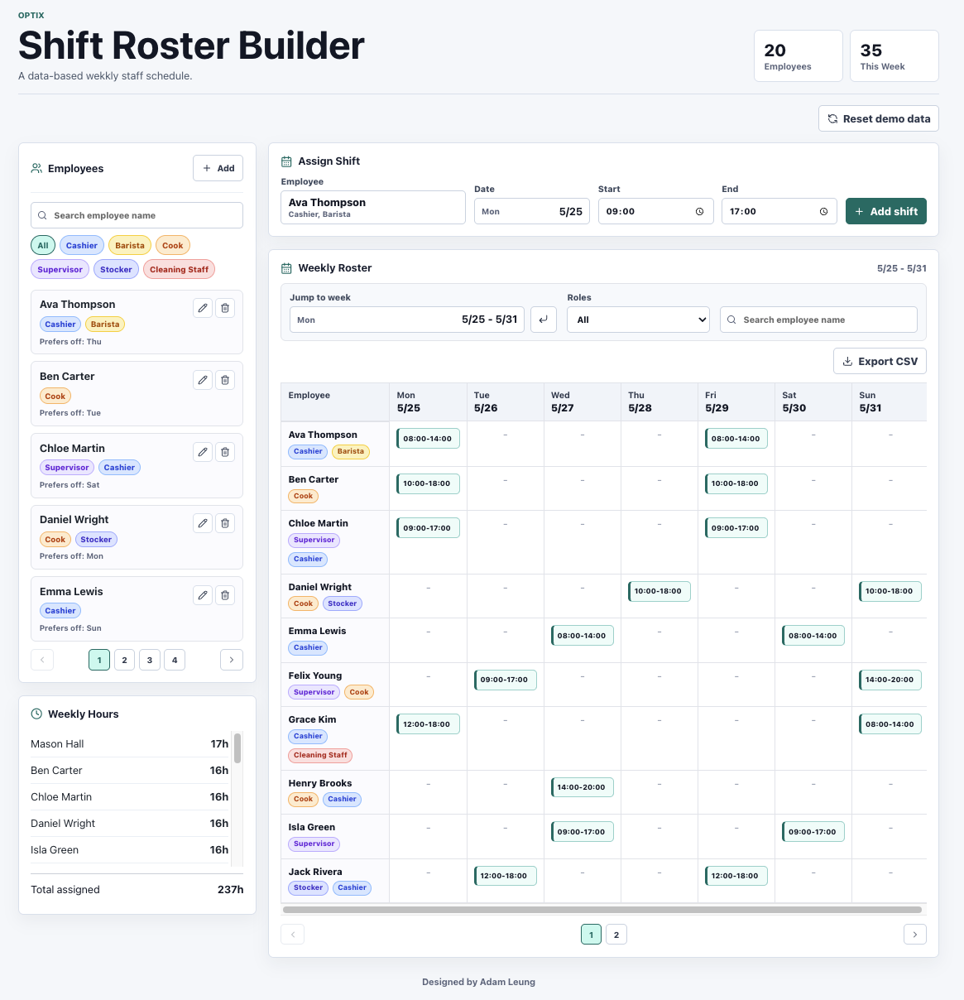

# Shift Roster Builder

Shift Roster Builder is a static React web app for building and validating a weekly staff schedule. It is designed for a small operations team where managers need to manage employees, assign shifts, check scheduling rules, review weekly hours, and export the visible roster as a CSV file.

[Open the deployed GitHub Pages app](https://adamleung16.github.io/Shift-Roster-Builder/)



## Setup

Install dependencies:

```bash
npm install
```

Run the development server:

```bash
npm run dev
```

Build the production version:

```bash
npm run build
```

Run the test suite:

```bash
npm run test
```

## Features

- Manage employees with names, multiple roles, and preferred days off.
- Use default roles such as `Cashier`, `Supervisor`, and `Cook`, plus custom roles.
- Assign shifts by employee, calendar date, start time, and end time.
- View the current week in a roster grid with employees as rows and dated weekdays as columns.
- Search and filter employees and the roster by name or role.
- Drag shift cards across the weekly grid to reassign employees or dates.
- Validate shifts before saving or dragging:
  - no overlapping shifts for the same employee on the same day
  - no more than five consecutive working days
  - no scheduling on an employee's preferred days off
- Track weekly hours and total assigned hours.
- Export the currently filtered weekly roster grid to CSV.
- Reset to a 20-person demo team with a prebuilt conflict-free weekly schedule.

## Data Storage

This project has no backend, database, or login system. All roster data is stored in the browser with `localStorage`.

That means:

- Refreshing the page keeps the current roster data.
- Clicking `Reset demo data` clears the saved roster and restores the built-in demo.
- Data is local to the browser and device where the app is opened.
- The deployed GitHub Pages version works as a fully static app.

## Design Decisions

- **React + Vite + TypeScript**: chosen for a fast static frontend, simple GitHub Pages deployment, and safer roster logic through typed models.
- **localStorage persistence**: keeps the app usable without a server while still preserving work after refresh.
- **Date-based scheduling**: shifts use concrete `YYYY-MM-DD` dates instead of only weekday names, so the roster can move between weeks.
- **Pre-save validation**: invalid assignments are blocked before they enter the grid, instead of relying only on visual conflict warnings after the fact.
- **Practical operations UI**: the app prioritizes dense, scannable controls over a marketing-style layout because managers need to compare employees, dates, shifts, and hours quickly.
- **Fixed demo data**: the demo looks varied but is deterministic, so screenshots, tests, and grading behavior stay consistent.

## Data Model

```ts
type Employee = {
  id: string;
  name: string;
  roles: string[];
  unavailableDays: Weekday[];
};

type Shift = {
  id: string;
  employeeId: string;
  date: string;
  startTime: string;
  endTime: string;
  role?: string;
};
```

Core roster calculations and conflict checks are implemented in `src/rosterLogic.ts`.

## GitHub Pages

The Vite base path is configured for this repository:

```ts
base: "/Shift-Roster-Builder/"
```

After building and deploying the static output, the GitHub Pages site can run all features directly in the browser because the app does not depend on a backend service.
